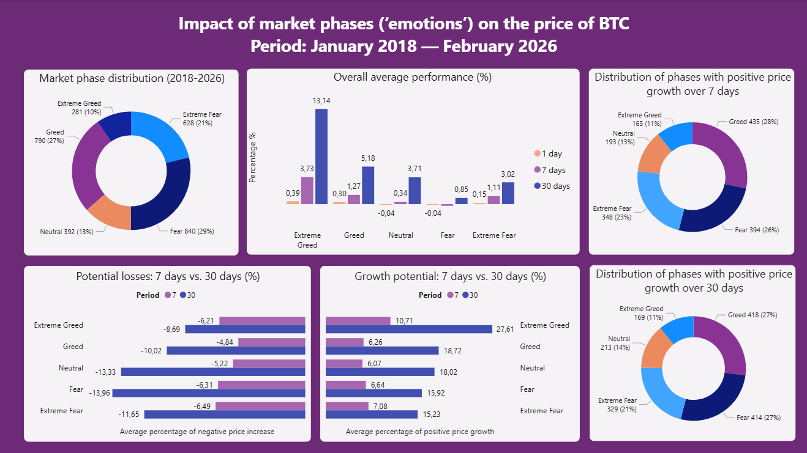

# Btc_analysis
## Project Overview
This project explores the correlation between market sentiment (using the **Fear & Greed Index**) and the actual price dynamics of **Bitcoin (BTC)**. 
The primary goal of the analysis is to determine whether extreme market sentiments serve as reliable indicators for predicting returns across various 
time lines (1, 7, and 30 days).

## Tech Stack
* **Python (Pandas, yfinance):** Used for data collection, cleaning, and preprocessing of historical cryptocurrency and sentiment data.
* **SQL Server:** Advanced data manipulation, complex analytical queries, and the creation of specialized Views for segmentation.
* **Power BI:** Used for building interactive dashboard to visualize correlations, trends, and the performance of sentiment-based trading strategies.

## Workflow
**1.** The project utilizes data from two primary sources. First is Crypto Fear & Greed Index, an index that aggregates emotions and sentiments from various sources into a single value ranging from 0 (Extreme Fear) to 100 (Extreme Greed). Second is Price Data, Historical Bitcoin (BTC) prices were retrieved from Yahoo Finance using the yfinance library. The dataset covers the period from February 5 2018 to February 17 2026, merged into a unified DataFrame for analysis.

**2.** The analysis focused on the Close price as the primary metric. Key analytical steps included: calculating average price performance across different sentiment categories; measuring price changes over multiple time lines: 1-day, 7-day, and 30-day periods; grouping performance metrics by sentiment levels to identify predictive patterns.

**3.** The final dashboard provides a comprehensive view of market behavior:

Sentiment Distribution: Total count of days the market spent in each emotional state.

Success Rate: The number of days with positive price growth over 7 and 30 days periods.

Average Performance: Mean percentage change in price for 1, 7, and 30 days periods.

Risk/Reward Profile: Analysis of potential gains and losses (average percentage of positive vs negative returns) segmented by sentiment.

## Conclusions
Contrary to the popular belief that "buying the top" is always bad, Extreme Greed exhibited a strong momentum effect. This state delivered the highest average returns over 7 days (3.7%) and 30 days (13%), proving that trend strength often outweighs high entry prices during market rallies.

While Extreme Greed is aggressive and volatile in the short term (7-day risk of ~6%), it becomes the safest and most profitable state on a 30-day horizon, with the lowest average drawdown (-8%) compared to all other sentiments.

Fear is the most common market state (840 days), yet it shows the lowest growth across all timeframes. This highlights the difficulty of generating returns during long times when the market is negative.

The Neutral state is unpredictable. It has high potential for both gains (like Greed) and losses (like Fear), making price movements hard to predict. This suggests that a lack of clear sentiment leads to chaotic, directionless price action.

The market spends nearly equal time in Greed (790 days) as it does in Fear, confirming the cyclical nature of Bitcoin over the last 8 years. Extreme Greed is the rarest and shortest-lived state (281 days), reflecting the instability of market peaks.

Disclaimer: The cryptocurrency market is characterized by extreme volatility. This analysis is based on historical data and is not a guarantee of future results. No single indicator can predict price movements with 100% certainty; however, understanding statistical patterns allows for data-driven decision-making rather than emotional trading.

## Description of project folders
1. Excel file after Python code located in `/Excel` folder.
2. Python code located in `/Python` folder.
3. SQL code are in `/SQL` folder.
4. Dashboards are in `/Power BI` folder.

